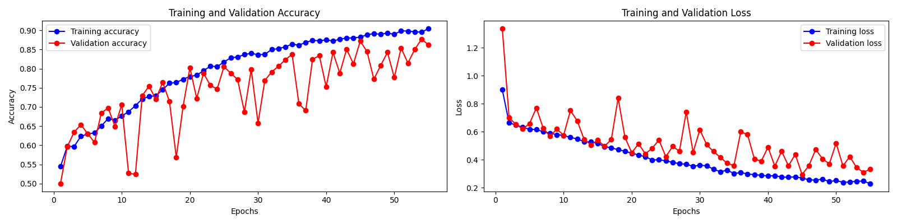

# Cat and Dog Image Classifier

## Introduction
The Cat and Dog Image Classifier is a deep learning project aimed at distinguishing between images of cats and dogs with high accuracy. Leveraging Convolutional Neural Networks (CNNs), this model represents a foundational approach to binary classification problems within computer vision.

## Project Description
This repository contains the code for a machine learning model that classifies images of cats and dogs. The model is built using TensorFlow and Keras and demonstrates the power of CNNs in image recognition tasks.

## Dataset
The training and validation data used in this project are sourced from Kaggle's Cat and Dog dataset. The images are preprocessed and augmented to improve the model's ability to generalize.

## Model Architecture
The model is a sequential CNN with multiple convolutional, max pooling, and dense layers. It includes dropout for regularization and batch normalization to standardize the inputs to each layer.

## Performance
The model achieves a high accuracy rate, which can be observed in the provided training and validation accuracy and loss plots.



## Key Features
- Data augmentation techniques to prevent overfitting
- Batch normalization to speed up training
- Early stopping to halt training when the validation loss is no longer decreasing
- A sequential CNN architecture that is both deep and broad, providing a balance between model complexity and computational efficiency

## How to Run
1. Clone the repository to your local machine.
2. Install the required dependencies.
3. Run the script to train the model.
4. Download dataset file from dataset branch and define it its loation in your directory .

## Technologies Used
- Python
- TensorFlow
- Keras

## Installation
To set up the project environment:

```bash
git clone https://github.com/Jamie10X/CatDogClassifier.git
cd Cat-and-Dog-Classifier
pip install -r requirements.txt

Usage
To train the model and evaluate its performance:
python train.py

Requirements
Python 3.x
TensorFlow 2.x
Keras
Contributing
Feel free to fork the project, submit pull requests, or send me your feedback and suggestions!

License
This project is open source and available under the MIT License.

Acknowledgments
Kaggle for providing the dataset.
The machine learning community for their valuable resources and discussions which greatly assisted this project.


